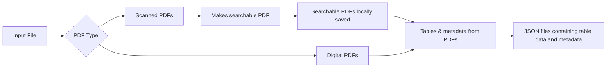

# PDF Table Extraction Pipeline

This project is a two-step pipeline for converting scanned PDFs into searchable PDFs and extracting tables from them into JSON format using OCR and table recognition tools.

## Features

- Converts scanned PDFs into searchable PDFs using PDF.co API
- Extracts tables from searchable PDFs using Camelot
- Saves extracted tables and metadata to structured JSON files

---

## Requirements

- Python 3.7+
- PDF.co API Key (required for OCR)
- Required Python packages:
  - `requests`
  - `camelot-py[cv]`
  - `PyMuPDF` (fitz)
  - `cryptography`

---

## Installation

**Clone the Repository**
   ```bash
   git clone <your-repo-url>
   cd <your-project-directory>
   ```
---

## Install Dependencies
   ```bash
   pip install -r requirements.txt
   ```
---

**If requirements.txt is not present, manually install:**
   ```bash
   pip install requests camelot-py[cv] PyMuPDF cryptography
   ```
## Configure API Key
**Create a config.py file in the root directory and insert your PDF.co API key:**
  ```bash
  API_KEY = "your_pdf_co_api_key_here"
  ```

---

## Usage
**Run the project using the main script:**
  ```bash
  python main.py
```

## Steps to run the project 
**Step 1: Convert to Searchable PDF**

You will be prompted:

Enter 1 to see the list of PDFs in your directory and choose one to convert.

The output will be saved as <filename>_searchable.pdf.
  ```bash
  Enter 1 to convert scanned PDFs to searchable PDFs or 0 to skip:
  ```


**Step 2: Extract Tables from Searchable PDFs**

You'll see a list of PDFs again.

Provide page ranges (e.g., 1-3, 1,3,5) as prompted
```bash
Enter the indices of the files (comma-separated) you want to extract tables from.
```
Extracted data will be saved as JSON in the output/ directory.

---

## Output

The project will generate JSON files containing:

Extracted tables (headers and rows)

PDF metadata (e.g., title, author, producer, etc.)

## Notes

The pipeline expects all PDF files to be in the same directory as the scripts.

An internet connection is required for OCR via the PDF.co API.

For large or complex tables, you may modify Camelot’s parsing mode (stream or lattice) in table_extraction.py.

